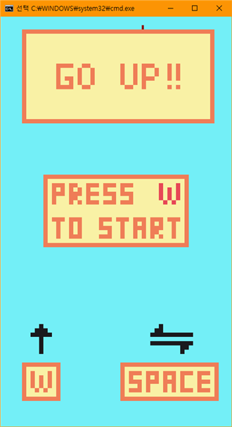
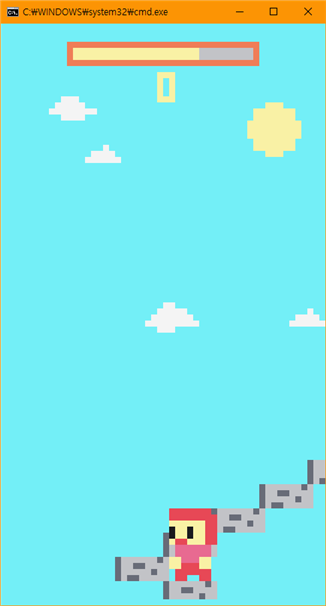
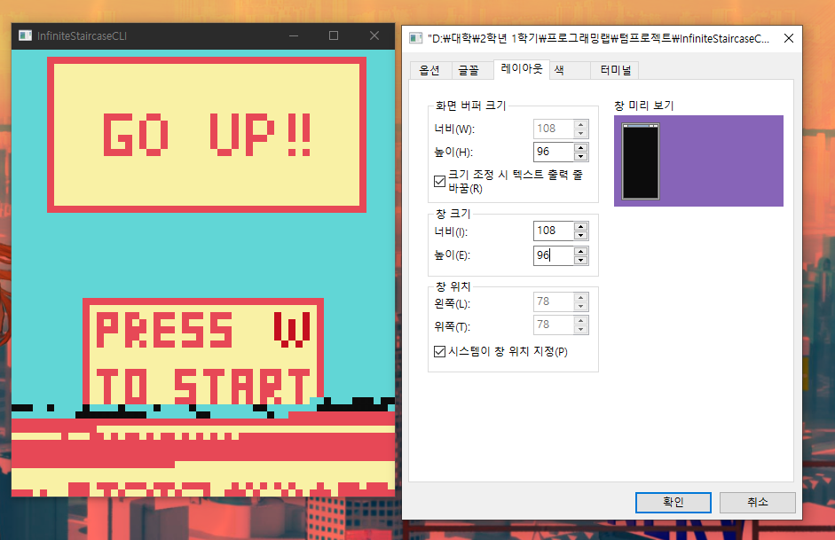
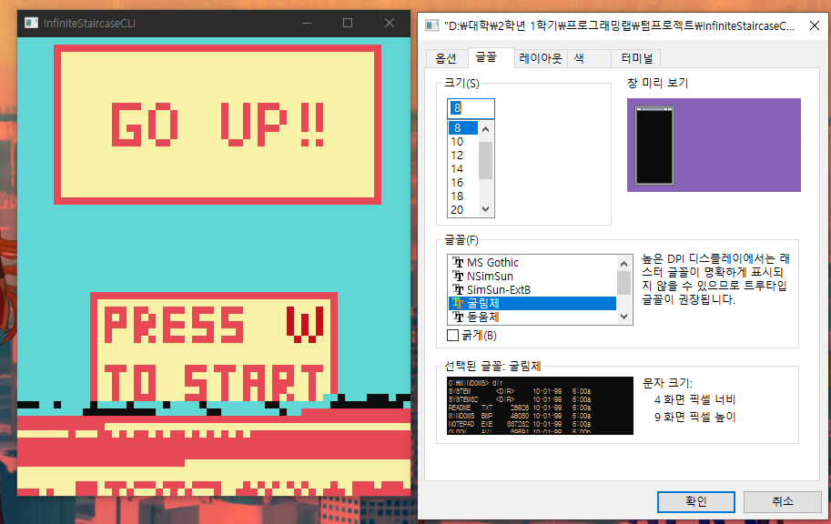

## 프로젝트 개요

<aside> 🕹️ 유명 인디게임인 “무한의 계단”을 C언어를 통해서 Window 명령 프롬프트로 플레이 할 수 있도록 구현한 프로젝트입니다.</aside>

## 특징

- 명령 프롬프트 기반 프로젝트 이지만 밀도감을 주기 위해 컬러를 사용
- 오브젝트 , 라이프 사이클등을 구현해서 확장성 있게 설계
- 오브젝트를 추가, 삭제, 이동등을 구현
- 오브젝트 애니메이션 구현(캐릭터 , 풍선 등)

## 주의사항

- 화면이 깨진다면 콘솔창 크기 및 글자 크기 설정을 하고 다시 종료후 실행해주세요 (108 , 96 , 8)

